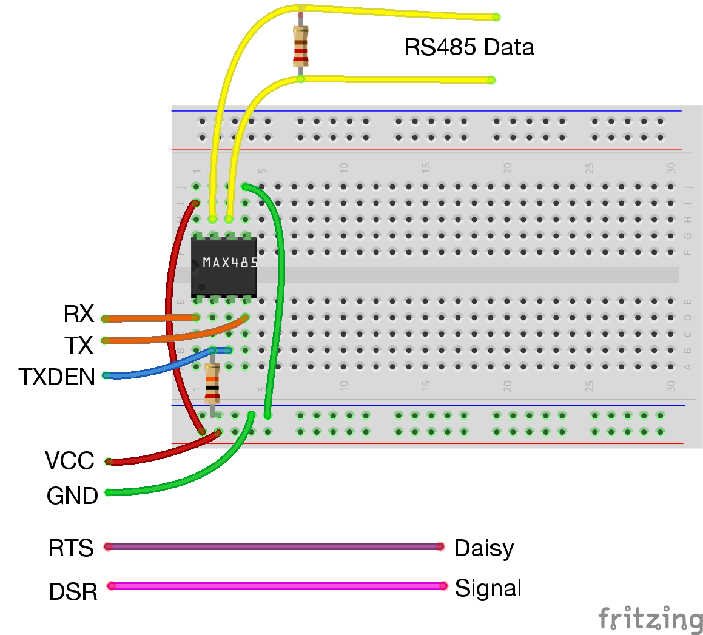
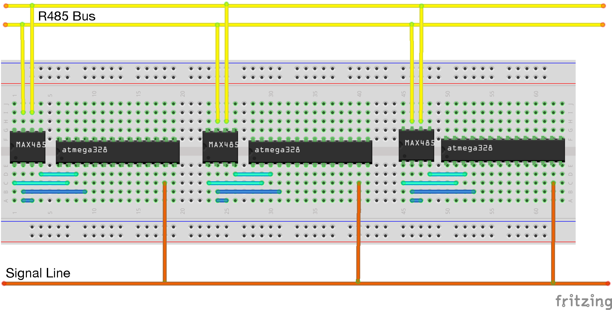

# Setup

Setting up your bus to be programmed is remarkably easy.

## Burning the bootloader

Before you can program the device on the bus, you'll need to burn the bootloader to it using
a standard AVR programmer (like a USBTiny, in my case)

Open `Makefile` and modify these values to match your device and clock speed:

```
MCU   = atmega328p
F_CPU = 20000000UL
```

If you modify any of the fuses, you need to make sure the Boot Flash Section is set to 512 words (`BOOTSZ=10`)
and the Boot Reset Vector enabled (`BOOTRST`).

If you're not using a USBTiny programmer, update this line with the programmer value that avrdude accepts.

```
PROGRAMMER_TYPE = usbtiny
```

Now we're ready to burn the bootloader. Connect your device to the programmer and run the following commands:

```
make
make fuses
make program
```

That's it. If all went well, it'll be ready to be programmed on the bus.

## Communication

Now you're going to need a way to communicate with your devices on the bus. Using an FTDI breakout board is the easiest
way to go, but you need to use one that provides access to the `DSR` pin for signal and `TXEN` for the RS485 transceiver.

### BOB-12731 FTDI Breakout

The [BOB-12731](https://www.sparkfun.com/products/12731) FTDI breakout board, by SparkFun, provides all the
necessary pins to interface with an RS485 transceiver. This is a crappy rendering of how to what to hook
the transceiver to this breakout board.

<a href="./diagrams/bob12731_to_485.png">
  </a>


### Custom - DiscoDongle

The [DiscoDongle](https://github.com/jgillick/disco-dongle) is a FTDI to RS485 adapter that is specially
designed for this purpose. It's an open design, so you can easily make one yourself or order one from
MacroFab (see README for instructions).


##  Bus Circuit

Here's a basic setup with 3 bus nodes (this diagram does not include power, clock crystals or decoupling caps).


